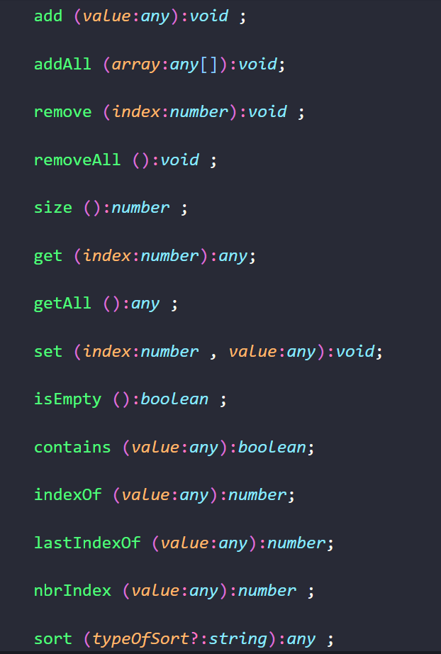

# ARRAYLIST-TN
---
[](https://travis-ci.org/3imed-jaberi/arraylist-tn)

### You can now use the arraylist in you typescript and javascript code easily ..

###### **`NOTE:`** you can send to me for add anything you want in [instgram](https://www.instagram.com/3imed_jaberi/) ..


## Installation 
---
- NPM :
```bash
$ npm install arraylist-tn
```

- YARN :
```bash
$ yarn add arraylist-tn
```


## Usage 
---
#### You can use this module like [ArrayList in the JAVA](https://www.w3schools.com/java/java_arraylist.asp) .. you don't need to change any thing ..




## Example
----
This is a basic example : 

```javascript
//
// ==> version : 1.0.0 ;
// const { ArrayList } = require ('arraylist-tn'); 
//
// ==> current version : 1.1.0 ; now we support import default.
//
const ArrayList = require ('arraylist-tn');  // || const { ArrayList } = require ('arraylist-tn'); 

const myList = new ArrayList();
myList.add('imed jaberi');
console.log(myList.getAll()); // [ 'imed jaberi' ]
myList.addAll(['nodejs','js-lover','tunisia','red','CA']); 
console.log(myList.getAll()); // [ 'imed jaberi', 'nodejs', 'js-lover', 'tunisia', 'red', 'CA' ]
myList.remove(4);
console.log(myList.getAll()); // [ 'imed jaberi', 'nodejs', 'js-lover', 'tunisia', 'CA' ]
console.log(myList.size()); // 5
console.log(myList.contains('CA')); // true
console.log(myList.isEmpty()); // false 
myList.removeAll(); 
myList.addAll([100,50,-50,0,-100]);
myList.sort(); // you can add "asc" as params 
console.log(myList.getAll()); // [ -100, -50, 0, 50, 100 ]
myList.sort("desc");
console.log(myList.getAll()); // [ 100, 50, 0, -50, -100 ]

```


#### License
---
[MIT](https://choosealicense.com/licenses/mit/) 
